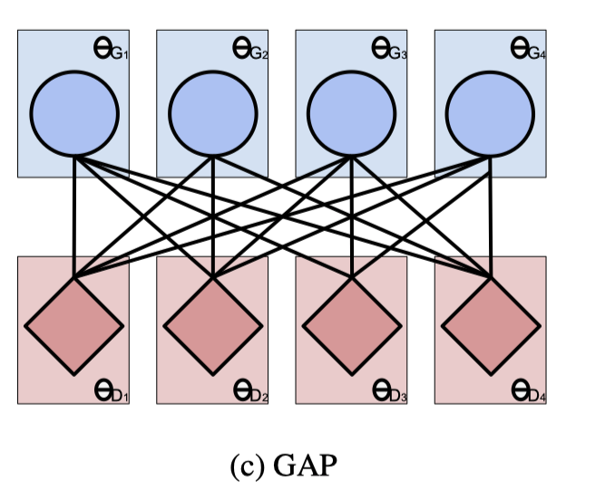

##### 本文要旨

本文核心思想就是使用多生成器和多判别器模型，让原本是一对一的关系变成多对多，**体现在一个生成器生成的样本交给多个判别器去判断**，如下图所示：

这种架构的好处是，**可以融合不同的GAN的变体**，比如可以全部是DCGAN或者全部是GRAN，也可以是2个GRAN和2个DCGAN。

##### 要点回顾

1. 本文使用openMPI，来实现GPU间内存传输而不是通过主机内存，以减少通信开销，主要是判别器之间的通信。
2. 本文的实验也很多，用到了很多度量方法，以后可能会用到，但是现在我没看懂。

