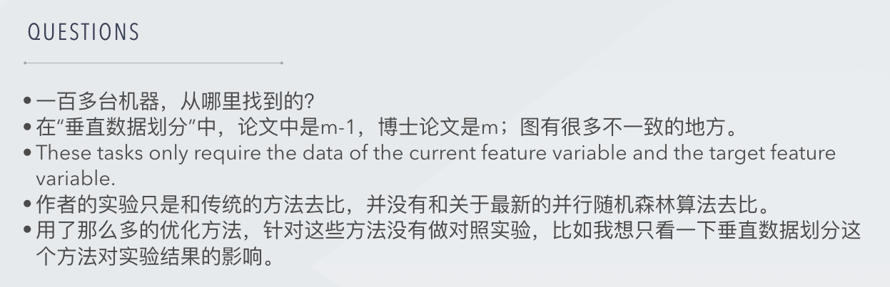
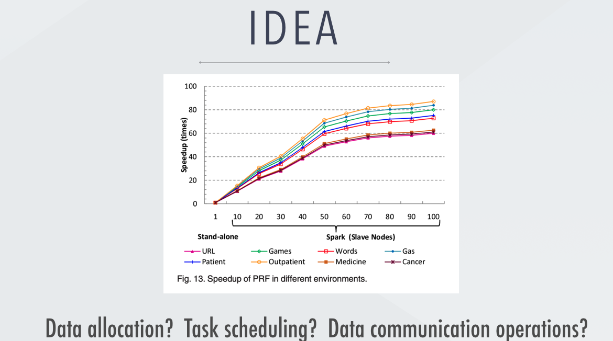
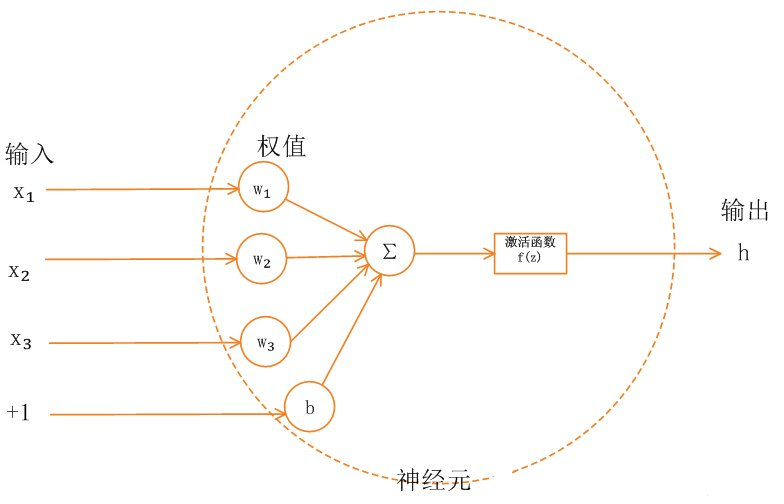

####A Parallel Random Forest Algorithm for Big Data in a Spark Cloud Computing Environment

#### 深度神经网络并行化研究综述

1. 2006年 Hinton 和 Salakhutdinov在 《Science》杂 志 上 发 表 的 论 文 解决了多层神经网络训练的难题。

   Hinton G E，Salakhutdinov R R.Reducing the dimensionality of data with neural networks.Science，2006，313(5786):504- 507

2. 神经元是人工神经网络的基本处理单元，一般是多输入单输出的单元。

3. 在深度神经网络中，为了求解代价函数，需要使用优化算法，常用的算法有**梯度下降法**、共轭梯度法、LBGFS 等，目前最常用的优化算法梯 度下降算法，**该算法的核心是最小化目标函数，在每次迭代中，对每个变量按照目标函数在该变量梯度的相反方向更新对应的参数值。**其中，参数学习率决定了函数到达最小值的迭代次数。梯度下降法有三种不同的 变 体 :批 量 梯 度 下 降 法 (Batch Gradient Descent，BGD)、随 机 梯 度 下 降 法 (Stochastic Gradient Descent， SGD)、小批量梯度下降法(Mini-Batch Gradient Descent，MBGD)。

4. 对深度神经网络的并行化目前主要有两种方 法 :模 型 并 行 和 数 据 并 行。多数情况下，模型并行带来的通信开销和同 步开销超过数据并行，因此加速比也不及数据并行， 但是对于单个计算设备内存无法容纳的大模型来 说，模型并行是一个很好的选择。

5. 深度神经网络的网络结构复杂，参数多，训练数 据量大，这些都为并行化工作带来了挑战。

6. 深度神经网络的应用分为**训练过程**和**推理过程**。对训练过程进行并行设计时，在单节点上，利用多核和众核技术 (GPU，MIC)进行并行加速 ;而对于单节点无法完成的大规模深度神经网络的训练过程，一般是结合 MPI或Spark完成节点间的数据通信，通过分布式系统完成对整个模型的训练。而并行加速推理过程时，目前研究重点是通过专用加速器或 FPGA 进行加速，具有功耗低、速度快的优点。

#### GPU-accelerated parallel hierarchical extreme learning machine on flink for big data

1. 激活函数

   1. 什么是激活函数

      首先要了解神经网络的基本模型。单一神经元模型如下图所示：

      

      神经网络中的每个神经元节点接受上一层神经元的输出值作为本神经元的输入值，并将输入值传递给下一层，输入层神经元节点会将输入属性值直接传递给下一层（隐层或输出层）。在多层神经网络中，上层节点的输出和下层节点的输入之间具有一个函数关系，这个函数称为激活函数（又称激励函数）。

   2. 激活函数的用途（为什么需要激活函数）？

      如果不用激励函数（其实相当于激励函数是f(x) = x），在这种情况下你每一层节点的输入都是上层输出的线性函数，很容易验证，无论你神经网络有多少层，输出都是输入的线性组合，与没有隐藏层效果相当，这种情况就是最原始的感知机（Perceptron）了，那么网络的逼近能力就相当有限。正因为上面的原因，我们决定引入非线性函数作为激励函数，这样深层神经网络表达能力就更加强大（不再是输入的线性组合，而是几乎可以逼近任意函数）。

   3. 常见激活函数

      Sigmoid函数、tanh函数、Relu函数及其改进型（如Leaky-ReLU、P-ReLU、R-ReLU等）在多层神经网络中应用比较多。

2. Tang et al.  proposed an **H-ELM framework** for MLPs.

   J. Tang, C. Deng, and G.-B. Huang, **“Extreme learning machine for multilayer perceptron,”** IEEE Trans. Neural Netw. Learn. Syst., vol. 27, no. 4, pp. 809–821, Apr. 2016.

3. **speedup**效果不明显？

   That is because, in terms of small DSTs, the communication overhead in PH-ELM and GH-ELM greatly affects the efficiency of the para-llelization. The running time of serial executions in PH-ELM and GPH-ELM also occupies a large proportion. Moreover, there also exists a fixed time for the application submission and configuration, it is reasonable that the whole speedup of processing small DSTs is small.

#### A bi-layered parallel training architecture for large-scale convolutional neural networks in distributed computing environments

1.平均运行时间

​	在3.3.1节中提到的平均运行时间，我个人觉得意义不大，因为计算机的运行应用数量是未知的，在这一段时间内可能只运行了作者的任务，得出的平均运行时间是可靠的，但是假如某一时刻有其他用户的任务运行，而根据平均运行时间得出的数据分布则不再合理。

2.强假设

​	we expect all nodes to complete each iteration as close as possible.这也是不现实的。

3.目标函数、损失函数、代价函数

​	损失函数和代价函数是同一个东西，目标函数是一个与他们相关但更广的概念，对于目标函数来说在有约束条件下的最小化就是损失函数（loss function）。

4.没有GPU加速CNN？

5.最后一个实验是衡量workload balance的，这个指标该如何量化？文中并没有给出公式。

6.main server

​	根据3.2.2节中对main server的描述，该节点的工作压力较大。

7. Convolutional Neural Network(CNN)

​	Convolutional Neural Network (CNN) algorithm is an important branch of Deep Learning (DL).

#### A Parallel Multiclassification Algorithm for Big Data Using an Extreme Learning Machine

1. Support vector machine [2], Naive Bayes(朴素贝叶斯) [3], and extreme learning machine (ELM) [4] are three important classification algorithms for big data at present.

####机器学习方面的顶会期刊

Journals

1. IEEE Transactions on Pattern Analysis and Machine Intelligence (TPAMI)
2. Journal of Machine Learning Research (JMLR)
3. IEEE Transactions on Knowledge and Data Engineering (TKDE)
4. IEEE Transactions on Image Processing (TIP)
5. ACM Transactions on Knowledge Discovery from Data (TKDD)
6. IEEE Transactions on Cybernetics (TCYB)
7. IEEE Transactions on Neural Networks and Learning Systems (TNNLS)
8. IEEE Transactions on Evolutionary Computation (TEC)
9. Machine Learning - Springer 
10. Pattern Recognition (PR)
11. Information Sciences
12. IEEE Transactions on Information Theory (TIT)
13. IEEE Transactions on Multimedia (TMM)
14. Annals of Statistics (AOS)
15. International Journal of Computer Vision (IJCV)
16. Artificial Intelligence (AIJ) - Elsevier

Conferences

1. ICML (International Conference on Machine Learning)
2. NeurIPS/ NIPS (Advances in Neural Information Processing Systems)
3. AAAI (AAAI Conference on Artificial Intelligence)
4. CVPR (IEEE Conference on Computer Vision and Pattern Recognition)
5. IJCAI (International Joint Conferences on Artificial Intelligence)
6. ICCV (IEEE International Conference on Computer Vision)
7. ICLR (International Conference on Learning Representations)
8. SIGKDD/ KDD (ACM Knowledge Discovery and Data Mining)
9. COLT (Annual Conference on Learning Theory)

#### ELECTRA

1. NLP名词解释

   1. token

      即句子中独立的单词，也称标记（token），包括标点。